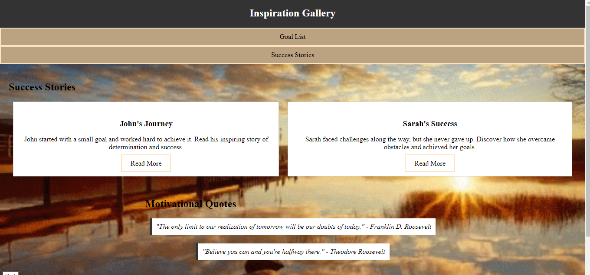
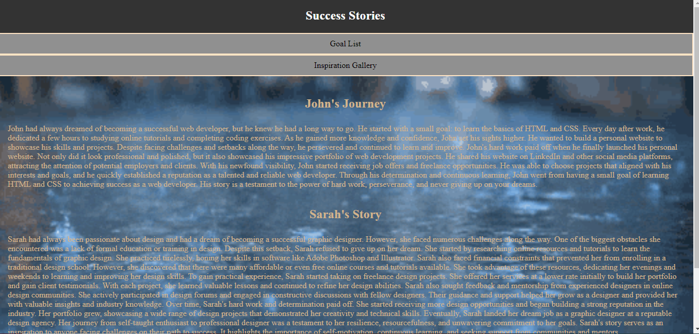

# Goals Website

This project is a website that allows users to set and track their goals. It includes features such as adding goals, marking them as completed, editing goals, deleting goals, and getting inspiration or jokes for motivation.

## Technologies Used

- HTML
- CSS
- JavaScript
- Express.js
- Axios
- Cors
- Node.js

## Features

- Add goals to the goal list
- Mark goals as completed
- Edit goals
- Delete goals
- Get random inspiration quotes
- Get random jokes for a laugh

## Installation

1. Clone the repository: `git clone <repository-url>`
2. Install dependencies: `npm install`
3. Start the server: `node index.js`
4. Open the website in your browser: `http://localhost:5000`

## Screenshots

## Contributing

Contributions are welcome! If you have any suggestions or find any issues, please open an issue or submit a pull request.
